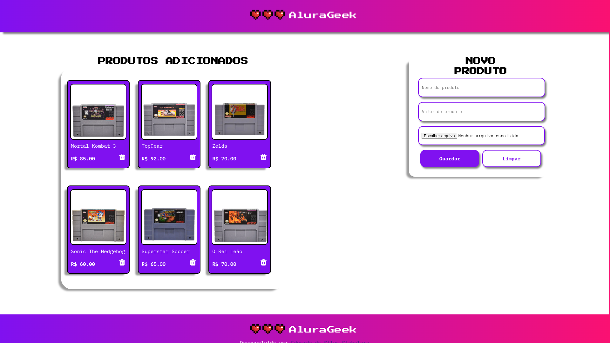

<div align="center"> 
  
  <br>
  <a href="https://www.alura.com.br" target="_blank">Alura</a>
</div>

---

# Alura Geek 💻🕹️

<div align="center"> 
  
</div>

## Preview do Projeto

[Link para o projeto](https://eduardosichelero.github.io/Alura_Geek_Shop/)

---

## Descrição 📜

Alura Geek é um modelo de loja online onde você pode adicionar, excluir e visualizar produtos. Este projeto foi desenvolvido como parte do desafio do programa T6 da Alura em parceria com a Oracle. 🏆

**Modelo do Figma**: [Link](https://www.figma.com/design/1zm3NNIw4KcI0RQtR6UmqK/New-AluraGeek---PT?node-id=0-1&t=fw0c0p3ipRBxMuhv-0)  
**Guia do Trello**: [Link](https://trello.com/b/Z9qSrZwj/new-alurageek-pt)

---

## Funcionalidades ✨

- **Adicionar Produtos**: Permite adicionar novos produtos com nome, valor e imagem.
- **Visualizar Produtos**: Exibe uma lista de produtos adicionados com nome, valor e imagem.
- **Excluir Produtos**: Permite excluir produtos da lista.
- **Banco de Dados**: Armazena os produtos utilizando um banco de dados interno simulado com JSON.

<div align="center"> 
  
</div>

---

## Tecnologias Utilizadas 🛠️

- **HTML**: Para a estrutura da página.
- **CSS**: Para estilização da aplicação.
- **JavaScript**: Para a lógica de funcionamento.
- **JSON Server**: Para simular um banco de dados.

---

## Como Executar 🚀

1. Clone este repositório:
   ```bash
   git clone https://github.com/seu_usuario/alura-geek.git
   ```

2. Navegue até o diretório do projeto:
   ```bash
   cd alura-geek
   ```

3. Instale as dependências:
   ```bash
   npm install
   ```

4. Inicie o JSON Server:
   ```bash
   npm start
   ```

5. Abra o arquivo `index.html` no seu navegador.

---

## Estrutura do Projeto 🗂️

```
alura-geek/
├── css/
│   ├── style.css
├── img/
│   ├── icon.png
│   ├── Logo.png
│   ├── MortalKombat.webp
│   ├── TopGear.webp
│   ├── Zelda.avif
│   ├── Sonic.webp
│   ├── Superstar.avif
│   ├── ReiLeao.webp
├── app/
│   ├── script.js
├── dados.json
├── index.html
├── README.md
├── package.json
```

<div align="center"> 
  
</div>

---

## Banco de Dados Interno 📂

```json
[
    {
        "id": 1,
        "imagem": "img/MortalKombat.webp",
        "produto": "Mortal Kombat 3",
        "valor": 85.0
    },
    {
        "id": 2,
        "imagem": "img/TopGear.webp",
        "produto": "TopGear",
        "valor": 92.0
    },
    {
        "id": 3,
        "imagem": "img/Zelda.avif",
        "produto": "Zelda",
        "valor": 70.0
    },
    {
        "id": 4,
        "imagem": "img/Sonic.webp",
        "produto": "Sonic The Hedgehog",
        "valor": 60.0
    },
    {
        "id": 5,
        "imagem": "img/Superstar.avif",
        "produto": "Superstar Soccer",
        "valor": 65.0
    },
    {
        "id": 6,
        "imagem": "img/ReiLeao.webp",
        "produto": "O Rei Leão",
        "valor": 70.0
    }
]
```

---

## Agradecimentos 🙏

Este projeto foi desenvolvido como parte do programa T6 da Alura em parceria com a Oracle. Agradecimentos especiais aos instrutores.